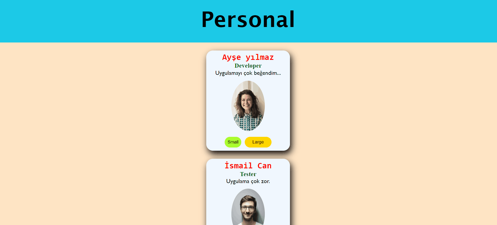

# Project: Personal List

## Description

Project aims to create a Personal List App.

## Problem Statement

- We are adding a new project to our portfolios. So you and your colleagues have started to work on the project.

## Project Skeleton

```
02 - Personal List App(folder)
|
|----readme.md         # Given to the students (Definition of the project)
SOLUTION
├── public
│     └── index.html
├── src
┣ 📂components
┃ ┃ ┣ 📜Header.jsx
┃ ┃ ┣ 📜Card.jsx
┃ ┃ ┣ 📜Footer.jsx 
┣ 📂scss
┃ ┣ 📜_reset.scss
┃ ┣ 📜_variables.scss
┃ ┣ 📜 app.scss
┃ ┣ 📜 card.scss
┃ ┣ 📜 foother.module.scss
┃ ┣ 📜 header.scss
┃ 
┣ 📜App.js
┣ 📜App.scss
┗ 📜index.js
```

## Expected Outcome



## Objective

Build a Personal List App using ReactJS.

### At the end of the project, following topics are to be covered;

- HTML

- CSS
- SASS

- JS

- ReactJS

### At the end of the project, students will be able to;

- improve coding skills within HTML & CSS & SASS & JS & ReactJS.

- use git commands (push, pull, commit, add etc.) and Github as Version Control System.

## Steps to Solution

- Step 1: Create React App using `npx create-react-app product-list-app` or `yarn create-react-app product-list-app`

- Step 2: Build personal-list-app using [`data.js`](./data.js).

- Step 4: Push your application into your own public repo on Github

- Step 5: Add project gif to your project and README.md file.


## Demo
[Live](https://react-pproduct-list.netlify.app/)

## Notes

- You can add additional functionalities to your app.

**<p align="center">&#9786; Happy Coding &#9997;</p>**